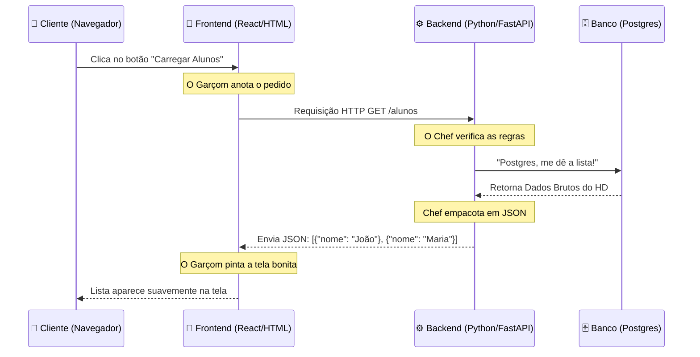

# 🚀 MT00 - A TRINDADE DA WEB E O CÉREBRO PYTHON (A TEORIA DE TUDO)
## Engenharia de Software ULTRA DIDÁTICA | SaaS Smart Academy Reborn

> **🎯 OBJETIVO EXTRAORDINÁRIO:** Antes de encostar em uma linha de código, você precisa entender o mapa do tesouro. Grandes engenheiros não decoram comandos cegamente; eles entendem o fluxo da informação. Neste documento, vamos destruir o "tecniquês" e explicar como a Internet real funciona, usando analogias que até uma criança entenderia.

---

## 📚 1. O RESTAURANTE DIGITAL (A GRANDE ANALOGIA)

Imagine que qualquer aplicativo moderno do mundo (Netflix, Uber, iFood ou o nosso) é, na verdade, um grande restaurante 3 Estrelas Michelin. O funcionamento da Web baseia-se na divisão estrita e obrigatória de três tarefas. 

### 🎨 O Frontend (O Salão e o Garçom)
É tudo aquilo que o usuário **vê e toca**. É a vitrine, as mesas, o cardápio com design luxuoso e o botão luminoso.
- **Tecnologias:** HTML (a estrutura), CSS (a pintura) e Javascript/React (o garçom que anda pelo salão).
- **A Regra de Ouro:** O Frontend **NUNCA** sabe a receita dos pratos e **NUNCA** tem a chave da despensa. Ele é apenas uma interface projetada para agradar o cliente. Se o cliente faz um pedido, o Garçom anota e envia a requisição para a cozinha.

### ⚙️ O Backend (A Cozinha e o Chef)
É o núcleo de processamento escondido nos fundos. O cliente da rua nunca entra na cozinha. 
- **A API (O Balcão de Atendimento):** Para o Garçom entregar o pedido ao Chef, ele precisa de um local seguro. A API (Application Programming Interface) é o **Balcão de Atendimento** da cozinha. O FastAPI constrói esse balcão perfeito, definindo exatamente por onde os pedidos entram e por onde os pratos saem.
- **O que faz:** Ele recebe o pedido do Garçom no Balcão (API), aplica as **Regras de Negócio** (ex: "O cliente pagou?", "O cliente tem permissão para ver essa tela?") e prepara a resposta.
- **O Nosso Herói (Python com FastAPI):** Escolhemos o Python para ser o nosso Chef. Por que? Porque ele é cirúrgico, incrivelmente rápido (com o framework FastAPI) e, acima de tudo, fala nativamente a língua da Inteligência Artificial.

### 🗄️ O Banco de Dados (A Despensa e o Cofre)
A cozinha não gera dados do nada; ela precisa buscar os ingredientes.
- **O que faz:** É o local de armazenamento absoluto, protegido e persistente. Onde guardamos a lista de alunos, senhas criptografadas e registros.
- **O Nosso Guardião (PostgreSQL):** Um dos bancos de dados relacionais mais seguros e robustos do mercado corporativo. **Importante:** O Chef (Backend) é o ÚNICO que tem a chave dessa despensa. O Frontend está proibido de chegar perto dela.

---

## 🧠 2. A INTEGRAÇÃO: COMO ELES CONVERSAM? (A LINGUAGEM JSON)

Se o Garçom (Frontend) e o Chef (Backend) vivem em mundos separados (e muitas vezes hospedados em máquinas e países diferentes na nuvem), como eles se comunicam?

Eles usam uma linguagem universal chamada **JSON** (JavaScript Object Notation). O JSON é basicamente a "Comanda de Papel" do restaurante. Ela não tem cor, não tem design, são apenas dados crus organizados em chaves e valores.

**Exemplo de Comanda JSON:**
```json
{
  "prato": "Lasanha de Queijo",
  "quantidade": 1,
  "preco_total": 45.50
}
```
O Garçom leva exatamente esse formato de texto puro para a Cozinha. Sem frescuras, apenas a informação que importa.

### 🧩 O Fluxo da Vida Real (Do Clique ao Banco)

Quando você clica em "Ver Alunos" no nosso futuro aplicativo, isto é o que acontece nos bastidores em uma fração de segundo:



---

## 🐍 3. O FATOR PYTHON (POR QUE ESTA ESCOLHA É BRILHANTE?)

Você pode estar se perguntando: "O mercado fala tanto de Node.js, Java, C#... Por que escolhemos Python para o coração do nosso sistema?"

1. **A Sintaxe "Pseudo-Código" (Sem Ruído Visual):** Python foi desenhado para ser lido pelo cérebro humano quase como se fosse inglês estruturado. Não há montanhas de chaves `{}` ou pontos e vírgulas `;` poluindo a tela. Para alunos leigos, é a linguagem com a menor taxa de desistência do mundo.
2. **O Rei Supremo dos Dados e da I.A.:** Lembre-se do nosso objetivo final (O Clímax do Projeto): vamos enviar um CSV com dados de sensores de gases (Etanol/Metanol) e pedir para a máquina prever os resultados. Se o nosso backend fosse em Node.js ou Java, teríamos que construir uma "ponte" complexa para falar com a inteligência artificial. Como estamos usando **Python desde o dia 1**, a IA (Scikit-Learn/Pandas) rodará nativamente dentro da nossa cozinha, com atrito zero.

---

## 🎓 4. EXERCÍCIO DE ALTA PERFORMANCE (NÍVEL ESTAGIÁRIO)

*Leia a situação abaixo e crie a resposta na sua cabeça ANTES de abrir a solução. Engane a preguiça e force a sinapse neuronal.*

**Cenário:** O estagiário Zezinho quer fazer a tela de "Atualizar Perfil" para o aluno. Para terminar mais rápido e ir jogar videogame, ele escreve um código no **Frontend (React)** que se conecta diretamente ao **Banco de Dados (Postgres)** pela porta 5432, enviando o novo nome do aluno e salvando, sem passar pelo Backend (FastAPI).
**Pergunta:** Por que essa ação do Zezinho resultaria na demissão sumária dele por justa causa em qualquer empresa séria?

<details>
<summary>👀 Ver o Veredito do Arquiteto</summary>
<b>Risco Crítico de Vazamento Global!</b><br>
Para o Frontend se conectar direto ao Banco de Dados, o Zezinho foi obrigado a colocar a <b>Senha de Administrador do Banco</b> dentro do código do Frontend. Como tudo no Frontend é baixado e executado no navegador do usuário, qualquer cliente que apertar a tecla <b>F12</b> consegue inspecionar o código-fonte, roubar a senha do banco, entrar no nosso servidor e deletar a empresa inteira em 3 minutos. <br>
<i>A Regra Imutável: O Frontend é território público (Zero Confiança). O Backend é o cofre protegido do servidor.</i>
</details>

---

## 🏆 O QUE VEM A SEGUIR?

Agora que você entende o Tabuleiro e as Peças, a brincadeira vai começar.
No próximo documento (**MT01**), não vamos escrever código ainda. Vamos preparar o **Terreno da Fábrica** usando o **Docker e Docker Compose**. Vamos aprender a subir um servidor de banco de dados imaculado na sua máquina com um único comando de terminal, sem sujar o seu sistema operacional.

**Está com a mente preparada?**
