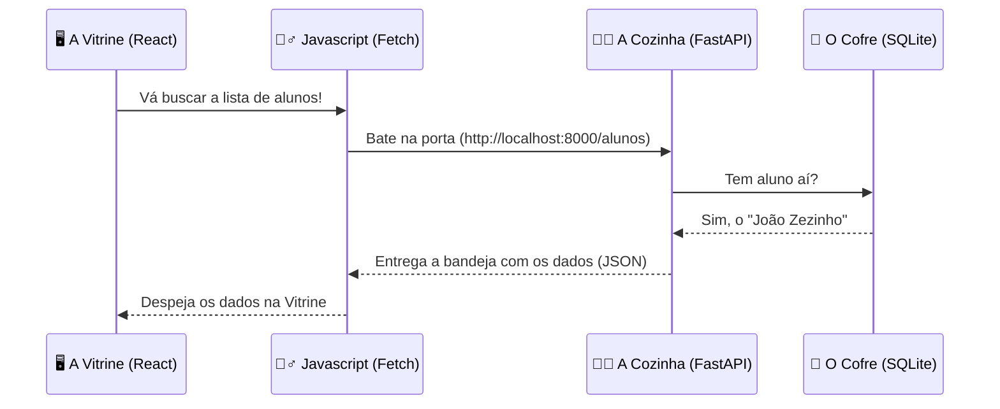

# 🚀 DIÁRIO DE BORDO: DIA 02 - O NASCIMENTO DA VITRINE


> **🎯 OBJETIVO EXTRAORDINÁRIO:** Seu backend já existe, mas ninguém consegue vê-lo. Hoje vamos construir a Vitrine da nossa loja. Para driblar os bloqueios de administrador dos computadores escolares, usaremos o "Cavalo de Troia" (Conda) para instalar o motor do Javascript (Node.js) em modo furtivo. Depois, criaremos um projeto React super rápido (Vite) para exibir o "João Zezinho".


## 🧠 2. O QUE É O REACT E O VITE?

### **🏭 A ANALOGIA DA FÁBRICA DE PLÁSTICO (VITE)**

- **❌ A Abordagem Amadora (HTML Puro):** Se você criar um site com `index.html` e colar 100 alunos na mão, no dia que um aluno mudar de nome, você terá que abrir os arquivos e mudar um por um. É o equivalente a esculpir o site inteiro em pedra. Se errar, quebra tudo.
- **✅ A Abordagem Enterprise (React + Vite):** O React trabalha com "Peças de Lego" (Componentes). Você desenha o modelo do cartão de aluno UMA ÚNICA VEZ. O Vite é a "Fábrica de Plástico" moderna. Antigamente, uma fábrica (Webpack) demorava 30 segundos para montar a estrutura. O Vite é uma Ferrari que monta a fábrica inteira do React em **1 segundo**.

---

## 🗺️ 3. ARQUITETURA VISUAL: O GARÇOM



---

## 🔧 4. O CÓDIGO (MÃO NA MASSA)

**Passo 1: O Hack do Administrador (Conda)**
🧡 
 Caso não tenho o nodeJS instalado e sem o Sudo. Vamos injetar o Node dentro da sua bolha do Miniconda."*
```bash
conda install nodejs -y
node -v
```

**Passo 2: Criando a Fábrica de Lego**
💻 * "Nós não criamos os arquivos React na mão. Nós mandamos os robôs trabalharem por nós."*
```bash
npm create vite@latest frontend -- --template react
cd frontend
npm install
npm run dev
```

**Passo 3: Ensinando o Garçom a Trabalhar (`App.jsx`)**
Apague tudo no `App.jsx` e crie a fundação:

```jsx
import { useState, useEffect } from 'react'
import './App.css'

function App() {
  // 1. A Memória da Tela (Onde os dados vão ficar)
  const [alunos, setAlunos] = useState([])

  // 2. O Gatilho de Disparo (Faça isso quando a tela abrir)
  useEffect(() => {
    fetch('http://localhost:8000/alunos')
      .then(resposta => resposta.json())
      .then(dados => setAlunos(dados))
  }, [])

  // 3. O Desenho da Vitrine
  return (
    <div className="painel">
      <h1>🚀 SaaS Smart Project</h1>
      <div className="lista-cards">
        {alunos.map(aluno => (
          <div key={aluno.id} className="card-aluno">
            <h2>{aluno.nome}</h2>
          </div>
        ))}
      </div>
    </div>
  )
}

export default App
```

---

## ⚖️ 5. TRIBUNAL DO CÓDIGO: O PERIGO DO LOOP INFINITO

❌ **CÓDIGO AMADOR (O que você faria sem treinamento):**
```jsx
// Fazer o fetch solto no meio do arquivo
fetch('http://localhost:8000/alunos').then(res => setAlunos(res.json()))
```
**O Defeito Letal:** O React redesenha a tela toda vez que o `setAlunos` é chamado. Se o `fetch` estiver solto, ele busca os dados -> atualiza a tela -> o React lê o arquivo de novo -> busca os dados de novo... **LOOP INFINITO**. Você vai fazer 5.000 requisições por segundo e derrubar (DDoS) o seu próprio servidor.

✅ **CÓDIGO PADRÃO OURO:**
O uso obrigatório do `useEffect( ... , [])`. O array vazio `[]` no final avisa o React: *"Por favor, execute o garçom APENAS UMA VEZ na vida, quando a página carregar pela primeira vez"*.

---

## 🚨 6. A BÍBLIA DE ERROS (TROUBLESHOOTING)

### 🐛 ERRO 1: A Tela Branca e a Barreira Vermelha (CORS)
**A Tela Mostra (No F12 - Console):** `Access to fetch at 'http://localhost:8000' from origin 'http://localhost:5173' has been blocked by CORS policy.`
**A Causa:** O seu Frontend (React) e o seu Backend (FastAPI) moram em portas diferentes (Casas diferentes). O navegador entra em pânico achando que você está sofrendo um ataque hacker tentando roubar dados de outra casa.
**A Solução Enterprise:** A *Dra. Clara (QA)* avisa: Você precisa voltar no `main.py` do Python e colocar o aviso na porta do restaurante dizendo "Eu permito que a casa 5173 pegue minha comida". (Uso do `CORSMiddleware`).

### 🐛 ERRO 2: O Terminal não reconhece o Vite
**A Tela Mostra:** `npm ERR! code ENOENT` ou `npm run dev` falhando.
**A Causa:** Você tentou rodar `npm run dev` na pasta raiz do projeto Python, e não dentro da pasta `/frontend` que acabou de criar. O NPM procura o arquivo `package.json` (A certidão de nascimento do app) e não acha.
**A Solução Enterprise:** Rode `cd frontend` antes de ligar o motor.

---

## 🎓 7. EXERCÍCIO DE ALTA PERFORMANCE (BATERIA)

### 🟡 Nível 2: Desenvolvedor Júnior
**Cenário:** O estagiário esqueceu de colocar o `key={aluno.id}` dentro do `.map` no React. A tela funcionou perfeitamente e o João Zezinho apareceu, mas o terminal ficou com um aviso vermelho `Warning: Each child in a list should have a unique "key" prop`. 
**Pergunta:** Por que o React é tão desesperado por essa propriedade `key`?
<details>
<summary>👀 Ver a Correção do Arquiteto</summary>
O React usa um "Supervisor Fantasma" (Virtual DOM) para saber o que mudou na tela. Se você tem 1.000 alunos e um deles muda de nome, o React olha para a `key` para saber EXATAMENTE qual dos 1.000 blocos de lego ele tem que trocar. Se não tiver `key`, o React entra em pânico e destrói os 1.000 blocos e constrói tudo de novo do zero, destruindo a performance do seu site. A `key` é o CPF do bloco de Lego.
</details>
