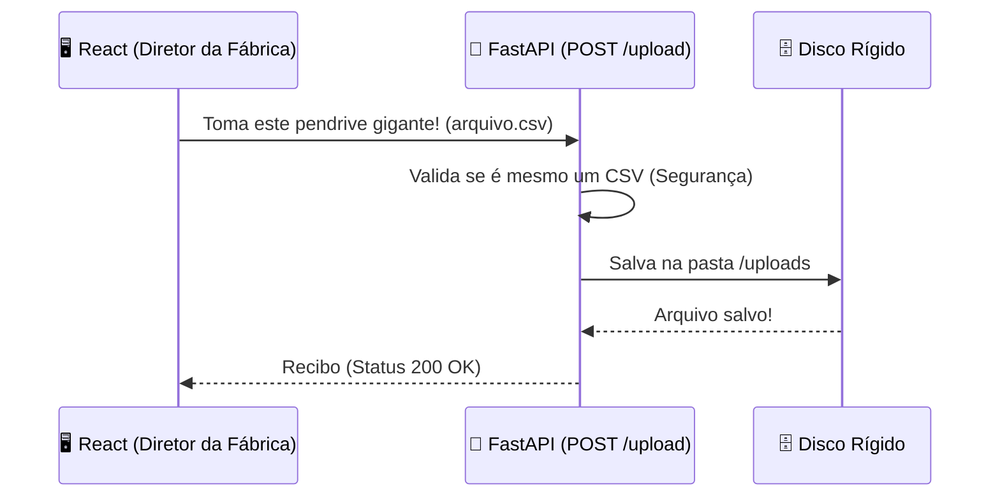

# 🚀 DIÁRIO DE BORDO: DIA 04 - A ESTEIRA DE DADOS (FASTAPI)
**Data:** 12 de Agosto de 2026 (Quarta-feira)
**Turma:** 3ª Série - Manhã - B
**Aula:** 07 (Bloco de 50 minutos)

> **🎯 OBJETIVO EXTRAORDINÁRIO:** 
Nosso Frontend já está bonito, mas é hora do Backend trabalhar de verdade. Vamos criar uma rota de upload (A Esteira de Dados) no FastAPI capaz de engolir um arquivo "pen-drive" gigabytes (o `.csv` da fábrica com os dados de Etanol e Metanol) para que depois a nossa IA possa estudá-los. 

---

## 📚 1. INTEGRAÇÃO CURRICULAR OFICIAL
* **CD - Aula 17 (Qual o seu tipo de dado?):** O Cientista de Dados abre o arquivo `.csv` pela primeira vez. Os dados são estruturados ou não-estruturados? As variáveis do sensor são categóricas (sim/não) ou contínuas (ex: 45.72 volts)?
* **APS - Aula 30 e 32 (Storytelling no negócio):** Entender a "dor" do cliente. O dono da fábrica não quer "fazer upload", ele quer "ver os problemas de gás" antes que a fábrica exploda. 

---

## 🧠 2.  O QUE É O UPLOAD EM UMA API?

### **📦 A METÁFORA DA ESTEIRA DE BAGAGENS**
- **❌ A Abordagem Leiga:** Você recebe os dados da fábrica por e-mail e tenta copiá-los para o banco de dados escrevendo milhares de vezes à mão. Impossível.
- **✅ A Abordagem Enterprise:** Nós construímos uma **Porta de Carga (Rota POST)** no nosso restaurante. Quando a fábrica joga o arquivo `.csv` na porta, o FastAPI (O Recebedor) pega essa "bagagem", abre a mala em milissegundos, salva o arquivo na despensa (pasta do projeto) e devolve um recibo para o Frontend: "Carga recebida com sucesso!".

---

## 🗺️ 3. ARQUITETURA VISUAL DO UPLOAD



---

## 🔧 4. O CÓDIGO (MÃO NA MASSA)

**Passo 1: As Ferramentas Especiais**
Para o FastAPI aceitar arquivos (Arquitetura de Multipart Form), precisamos instalar um pacote especializado.
```bash
# Na pasta do backend com o venv ativado:
pip install python-multipart
```

**Passo 2: Abrindo a Porta de Carga (`main.py`)**
💻 *Dr. Bruno (Arquiteto de Software): "Nós não deixamos qualquer lixo entrar no nosso servidor. Se o cara mandar um `.exe` com vírus, a gente bloqueia. Nós só aceitamos papel impresso (CSV)."*

No final do `main.py`, injetamos a rota de Upload:
```python
from fastapi import UploadFile, File, HTTPException
import shutil
import os

# Cria a pasta despensa se ela não existir
os.makedirs("uploads", exist_ok=True)

@app.post("/upload-sensor")
async def receber_dados(file: UploadFile = File(...)):
    # 1. A Segurança da Porta (Evita vírus)
    if not file.filename.endswith('.csv'):
        raise HTTPException(status_code=400, detail="Ei! Apenas arquivos CSV são permitidos aqui.")
        
    # 2. O Destino (A Despensa)
    caminho_salvar = f"uploads/{file.filename}"
    
    # 3. Guardando a bagagem
    with open(caminho_salvar, "wb") as buffer:
        shutil.copyfileobj(file.file, buffer)
        
    return {"mensagem": "O Pen-drive chegou seguro!", "arquivo": file.filename}
```

**Passo 3: Testando a Rota sem o React (O Swagger Mágico)**
O FrontEnd ainda não tem o botão de upload, então vamos testar direto na porta de carga!
1. Com a API rodando, acesse `http://localhost:8000/docs` no navegador.
2. Encontre a rota verde `POST /upload-sensor`.
3. Clique em "Try it out", escolha o seu arquivo `.csv` e clique em "Execute". 
4. Olhe na pasta do seu projeto. A pasta `uploads/` foi criada e o seu arquivo está seguro dentro dela!

---

## ⚖️ 5. TRIBUNAL DO CÓDIGO: LEITURA BLOQUEANTE

❌ **CÓDIGO AMADOR (Júnior):**
O Júnior tenta ler o arquivo inteiro jogando ele todo de uma vez na Memória RAM ( `arquivo_lido = file.read()` ).
**O Defeito Letal:** Se a fábrica enviar um CSV de 4 Gigabytes, o computador da escola tem apenas 2GB livres. O sistema estoura o limite de memória (OOM - Out of Memory) e o servidor desliga imediatamente. A tela fica azul.

✅ **CÓDIGO PADRÃO OURO:**
O uso do `shutil.copyfileobj` e do `wb` (Write Binary). Ele pega a água do "Cano Grande" e vai despejando no balde "gota a gota". Ele não carrega os 4GB de uma vez na memória, ele lê pedacinhos e salva pedacinhos no HD até terminar. O sistema consome quase Zero Memória RAM. É bruxaria matemática!

---

## 🚨 6. A BÍBLIA DE ERROS (TROUBLESHOOTING)

### 🐛 ERRO 1: A Rota "Method Not Allowed"
**A Tela Mostra (No Insomnia/Postman):** `405 Method Not Allowed`
**A Causa Oculta:** Você criou a rota com `@app.post`, mas na hora de testar no Postman ou no navegador (O navegador, por padrão, sempre faz `GET`), você tentou acessá-la batendo na URL. 
**A Solução Enterprise:** Entregar pacotes pesados exige o caminhão do `POST`. Navegadores comuns só fazem `GET`. Para testar, use o `/docs` mágico do próprio FastAPI (Swagger) e faça o upload por lá.

---

## 🎓 7. EXERCÍCIO DE ALTA PERFORMANCE (BATERIA)

### 🟡 Nível 2: Desenvolvedor Júnior
**Cenário:** O estagiário Zezinho subiu o arquivo chamado `sensor.csv`. O arquivo foi para a pasta `/uploads`. 5 minutos depois, a outra fábrica mandou um arquivo diferente, mas TAMBÉM com o nome `sensor.csv`.
**Pergunta:** O que acontece quando os dois passam pela Rota? O que deveríamos adicionar no nome do arquivo salvo para evitar demissão por justa causa?
<details>
<summary>👀 Ver a Punição do Estagiário</summary>
O computador é estúpido e obedece. Quando o segundo arquivo chegar, ele **SOBRESCREVE** (apaga e substitui) o primeiro arquivo, gerando Perda de Dados Crítica. Para salvar seu emprego, o Sênior sempre concatena (cola) o horário/data exata em que o arquivo chegou no nome dele antes de salvar. Ex: `2026-08-12-14h30_sensor.csv`.
</details>
