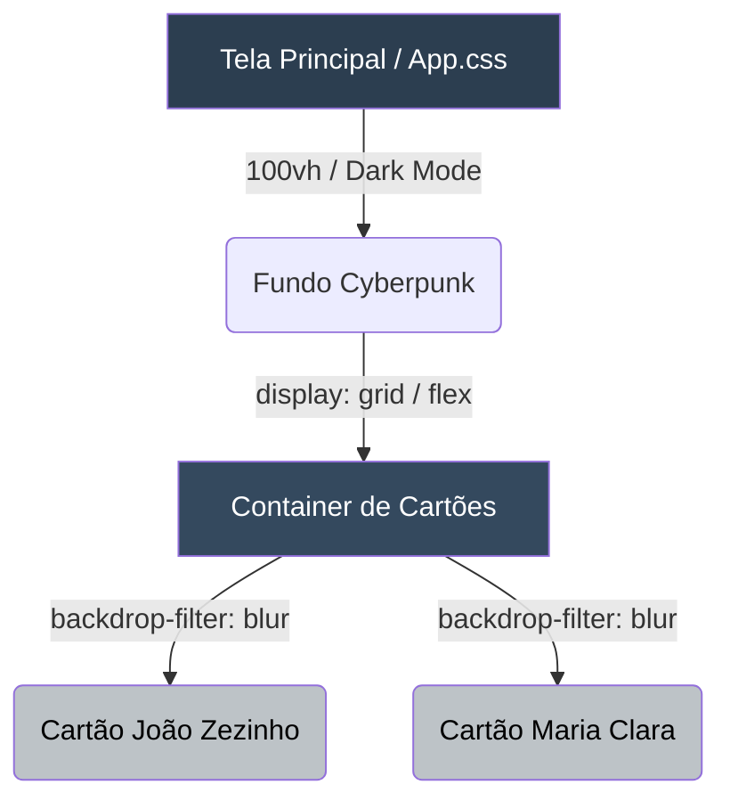

# 🚀 DIÁRIO DE BORDO: DIA 03 - PINTANDO A VITRINE (UI/UX)


> **🎯 OBJETIVO EXTRAORDINÁRIO:** Aulas passadas nós levantamos as paredes de alvenaria do React (A funcionalidade pura). Hoje nós seremos os Arquitetos de Interiores. Vamos aplicar Engenharia de Interface e Psicologia Visual. A tela não será apenas funcional, ela terá um *Look and Feel Premium*, utilizando técnicas modernas de mercado como CSS Grid, Dark Mode e Glassmorphism.

---

---

## 🧠 2. - O QUE É O GLASSMORPHISM E O CSS GRID?

### **🎨 A METÁFORA DO MUSEU DE ARTE**
- **❌ A Abordagem Amadora (Design Caótico):** O programador júnior escreve os dados na tela do jeito que o computador cospe. Parece um bloco de notas do Windows 95. Se o cliente abrir no celular, o texto sai da tela e quebra. É como jogar 50 quadros valiosos no chão do museu e mandar os visitantes procurarem.
- **✅ A Abordagem Enterprise (UX/UI):** A *Dra. Ana* entra em ação. O Museu (A Tela) ganha o **CSS Grid** (paredes perfeitamente alinhadas matematicamente). Atrás de cada obra de arte, usamos o **Glassmorphism** (O Efeito Vidro Fosco). Em vez de blocos cinzas opacos, os cartões parecem placas de vidro flutuando sobre um fundo moderno escuro (Dark Mode). Isso descansa os olhos do operador da fábrica e dá uma sensação de software de 1 milhão de dólares.

---

## 🗺️ 3. ARQUITETURA VISUAL: O GRID



---

## 🔧 4. O CÓDIGO (MÃO NA MASSA)

**Passo 1: A Tipografia (Aula CG 17)**
🎨 *Dra. Ana (Diretora de Arte): "Nunca use a fonte padrão do navegador. Fontes padrão gritam amadorismo. Vamos importar a família 'Inter' do Google Fonts."*
No arquivo `index.css`, adicione na primeira linha:
```css
@import url('https://fonts.googleapis.com/css2?family=Inter:wght@400;600;800&display=swap');

* {
  font-family: 'Inter', sans-serif;
  margin: 0;
  padding: 0;
  box-sizing: border-box;
}
```

**Passo 2: O Fundo Escuro e o Grid (Aula CG 22)**
Abra o `App.css` e vamos montar o esqueleto do Museu:
```css
body {
  /* O Dark Mode - Azul muito escuro para não cansar o olho */
  background-color: #0f172a; 
  color: #f1f5f9;
  min-height: 100vh;
}

/* O Container Flexível */
.lista-cards {
  display: grid;
  /* Cria colunas que se espremem ou esticam sozinhas dependendo da tela */
  grid-template-columns: repeat(auto-fit, minmax(280px, 1fr));
  gap: 20px;
  padding: 2rem;
}
```

**Passo 3: A Mágica do Vidro (Aula CG 24)**
💻 *Dr. Bruno (Arquitetura CSS): "O Glassmorphism não é uma imagem, é um cálculo matemático de desfoque de pixels feito pela placa de vídeo do usuário em tempo real."*
```css
.card-aluno {
  /* O Vidro Translúcido */
  background: rgba(255, 255, 255, 0.05);
  backdrop-filter: blur(10px);
  -webkit-backdrop-filter: blur(10px);
  
  /* A Moldura */
  border: 1px solid rgba(255, 255, 255, 0.1);
  border-radius: 16px;
  padding: 24px;
  
  /* A Sombra e Animação */
  box-shadow: 0 4px 30px rgba(0, 0, 0, 0.1);
  transition: transform 0.3s ease, border-color 0.3s ease;
}

/* A Interação de Vida (Hover) */
.card-aluno:hover {
  transform: translateY(-5px);
  border-color: #38bdf8;
}
```

---

## ⚖️ 5. TRIBUNAL DO CÓDIGO: O INFERNO RESPONSIVO

❌ **CÓDIGO AMADOR (Júnior):**
```css
.card-aluno {
  width: 300px; /* ERRO LETAL */
  height: 200px;
}
```
**O Defeito Letal:** O Júnior colocou larguras FIXAS. Quando o Diretor da fábrica abrir o sistema no celular, o cartão de 300px não vai caber na tela, gerando aquela temida barra de rolagem horizontal. O Diretor tenta dar zoom, a tela quebra, ele fecha o aplicativo com raiva.

✅ **CÓDIGO PADRÃO OURO (Pleno/Sênior):**
Nunca se trava a largura em pixels brutos para containers principais. Usamos o milagre matemático do `grid-template-columns: repeat(auto-fit, minmax(280px, 1fr));`. O navegador entende sozinho: "Se houver espaço, coloque lado a lado. Se a tela for pequena, jogue para a linha de baixo". A responsividade acontece sozinha, sem Media Queries de `1000 linhas`.

---

## 🚨 6. A BÍBLIA DE ERROS (TROUBLESHOOTING)

### 🐛 ERRO 1: O Efeito Vidro Sumiu!
**A Tela Mostra:** O cartão ficou com um fundo cinza feio, sem transparência, parecendo bloco de chumbo.
**A Causa Oculta:** Você esqueceu do `-webkit-backdrop-filter`. Navegadores baseados em Safari (iPhones e Macs) precisam desse prefixo antiquado para entender o desfoque de fundo. Sem ele, os clientes da Apple veem seu sistema quebrado.
**A Solução Enterprise:** Sempre declare `backdrop-filter: blur(10px);` e logo abaixo `-webkit-backdrop-filter: blur(10px);`.

---

## 🎓 7. EXERCÍCIO DE ALTA PERFORMANCE (BATERIA)

### 🟡 Nível 2: Desenvolvedor Júnior
**Cenário:** O estagiário Zezinho aplicou a regra `margin-bottom: 20px;` em TODOS os cartões para desgrudar um do outro. 
**Pergunta:** Por que a Dra. Ana demitiria o Zezinho por usar `margin` num projeto de 2026, e qual comando de apenas 3 letras resolve o espaçamento de forma simétrica?
<details>
<summary>👀 Ver o Segredo da Dra. Ana</summary>
Usar `margin` solto hoje em dia gera dor de cabeça quando os itens encostam nas bordas invisíveis da tela. Como estamos usando o sistema `grid` ou `flex`, a propriedade correta é o `gap: 20px;`. O `gap` aplica o espaçamento APENAS no buraco entre os cartões, e não nas bordas externas. É um código elegante, matemático e impossível de quebrar.
</details>
